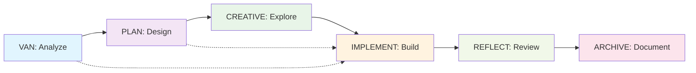

# GitHub Copilot Memory Bank - Quick Start Guide

*Get up and running with the Memory Bank system in 5 minutes*

## 🚀 Quick Setup

### 1. Clone or Download

```bash
git clone https://github.com/phillip1029/github-copilot-with-memory-bank.git
cd github-copilot-with-memory-bank
```

### 2. Copy to Your Project (Optional)

You can either:

- **Option A**: Use this as a reference repository
- **Option B**: Copy the files you need to your existing project
- **Option C**: Start a new project using this structure

### 3. Start with VAN Mode

Copy the VAN prompt from `prompts/van_mode.md` and paste it into GitHub Copilot Chat in your IDE.

## 🎯 30-Second Workflow Overview



## 📁 What You Get

```
github-copilot-with-memory-bank/
├── 📁 prompts/           # Ready-to-use prompt templates
│   ├── van_mode.md       # 🔍 Analysis & validation
│   ├── plan_mode.md      # 📋 Planning & architecture
│   ├── creative_mode.md  # 🎨 Design exploration
│   ├── implement_mode.md # ⚒️ Code implementation
│   ├── reflect_mode.md   # 🔍 Review & learning
│   ├── archive_mode.md   # 📚 Documentation
│   └── qa_validation.md  # ✅ Quality assurance
├── 📁 templates/         # Document templates
├── 📁 workflows/         # Step-by-step guides
├── 📁 examples/          # Usage examples
├── 📁 docs/             # Generated documentation
└── 📁 contexts/         # Active context tracking
```

## ⚡ First Steps

### Step 1: Analyze Your Project (VAN Mode)

1. Open GitHub Copilot Chat in your IDE
2. Copy this prompt:

```markdown
@workspace VAN MODE ANALYSIS

Please perform a comprehensive analysis of this project/codebase and provide:

## 1. PROJECT OVERVIEW
- Project type and primary technology stack
- Current state and development phase
- Key components and their purposes

## 2. COMPLEXITY ASSESSMENT
Based on the following criteria, determine the complexity level:

**Level 1 (Simple)**: Basic functionality, minimal dependencies
**Level 2 (Moderate)**: Multiple components, some integration complexity
**Level 3 (Complex)**: Advanced features, multiple integrations
**Level 4 (Enterprise)**: Large-scale architecture, multiple systems

Current Complexity Level: [1/2/3/4]

## 3. RECOMMENDED WORKFLOW
Based on complexity level, recommend next development phases and immediate next steps.

Please structure your analysis and save key findings to project context.
```

3. Paste and run in Copilot Chat
4. Review the complexity assessment and recommended workflow

### Step 2: Choose Your Path

Based on VAN analysis complexity level:

| Level               | Workflow                                                   | Next Step            |
| ------------------- | ---------------------------------------------------------- | -------------------- |
| **Level 1**   | VAN → IMPLEMENT → REFLECT                                | Go to IMPLEMENT mode |
| **Level 2**   | VAN → PLAN → IMPLEMENT → REFLECT                        | Go to PLAN mode      |
| **Level 3-4** | VAN → PLAN → CREATIVE → IMPLEMENT → REFLECT → ARCHIVE | Go to PLAN mode      |

### Step 3: Follow the Workflow

Use the corresponding prompt templates from the `prompts/` directory for each phase.

## 🔄 Common Workflows

### Simple Bug Fix (Level 1)

```
🔍 VAN (2 minutes) → ⚒️ IMPLEMENT (30 minutes) → 🔍 REFLECT (5 minutes)
```

### Feature Development (Level 2)

```
🔍 VAN (10 minutes) → 📋 PLAN (20 minutes) → ⚒️ IMPLEMENT (2-5 days) → 🔍 REFLECT (15 minutes)
```

### Complex Feature (Level 3)

```
🔍 VAN (20 minutes) → 📋 PLAN (1 hour) → 🎨 CREATIVE (30 minutes) → ⚒️ IMPLEMENT (1-3 weeks) → 🔍 REFLECT (30 minutes) → 📚 ARCHIVE (1 hour)
```

## 💡 Pro Tips

### 1. Use @workspace

Always start prompts with `@workspace` to give Copilot full project context.

### 2. Maintain Context

- Update `contexts/active_context.md` regularly
- Save important outputs from each phase
- Reference previous phase outputs in subsequent phases

### 3. QA Anytime

Type "QA" in any mode when you need validation:

```markdown
@workspace QA VALIDATION - COMPREHENSIVE QUALITY ASSURANCE

Perform quality assurance validation for: [SPECIFIC COMPONENT]
[Use the QA template from prompts/qa_validation.md]
```

### 4. Adapt the Prompts

- Customize templates for your technology stack
- Add your team's specific requirements
- Include domain-specific considerations

## 📖 Example Usage

### Real Scenario: "Add user authentication to my React app"

1. **VAN Analysis** (2 minutes):

   ```markdown
   @workspace VAN MODE ANALYSIS
   Analyze adding user authentication to this React application...
   ```

   *Result: Level 2 complexity, needs planning*
2. **PLAN Mode** (15 minutes):

   ```markdown
   @workspace PLAN MODE - IMPLEMENTATION PLANNING
   Create implementation plan for user authentication...
   ```

   *Result: Detailed task breakdown and architecture decisions*
3. **IMPLEMENT Mode** (2-3 days):

   ```markdown
   @workspace IMPLEMENT MODE - CODE IMPLEMENTATION
   Implement user authentication system...
   ```

   *Result: Working authentication with login/register/logout*
4. **REFLECT Mode** (10 minutes):

   ```markdown
   @workspace REFLECT MODE - REVIEW & LEARNING
   Review the authentication implementation...
   ```

   *Result: Lessons learned and improvement suggestions*

## 🔧 Customization

### Adapt for Your Stack

Edit prompt templates to include:

- Your preferred frameworks and libraries
- Team coding standards and conventions
- Specific deployment environments
- Company-specific security requirements

### Example Customization

```markdown
# In implement_mode.md, add your stack specifics:

### Technology Stack Requirements
- **Frontend**: React 18+ with TypeScript
- **Backend**: Node.js with Express and TypeScript  
- **Database**: PostgreSQL with Prisma ORM
- **Testing**: Jest and React Testing Library
- **Styling**: Tailwind CSS with component library
```

## 🆘 Troubleshooting

### Copilot Not Following Templates?

- Ensure you're using `@workspace` in prompts
- Be more specific about what you want
- Break complex requests into smaller parts
- Ask follow-up questions for clarification

### Workflow Seems Too Heavy?

- Start with Level 1 workflow for any project
- Skip phases that don't add value for your situation
- Use QA mode instead of full phases for quick validation

### Lost Context Between Sessions?

- Update `contexts/active_context.md` regularly
- Save phase outputs to project documentation
- Reference previous outputs in new prompts

## 📚 Further Reading

- **[Full Documentation](README.md)**: Complete system overview
- **[Complexity Guide](workflows/complexity_level_guide.md)**: How to assess project complexity
- **[Complete Example](examples/getting_started_example.md)**: Task management API walkthrough
- **[Original Cursor Memory Bank](https://github.com/vanzan01/cursor-memory-bank)**: Inspiration for this system

## 🤝 Contributing

Found improvements or have suggestions?

1. Fork the repository
2. Make your changes
3. Submit a pull request
4. Share your experience with the community

---

**Ready to start?** Copy the VAN mode prompt and paste it into GitHub Copilot Chat! 🚀
